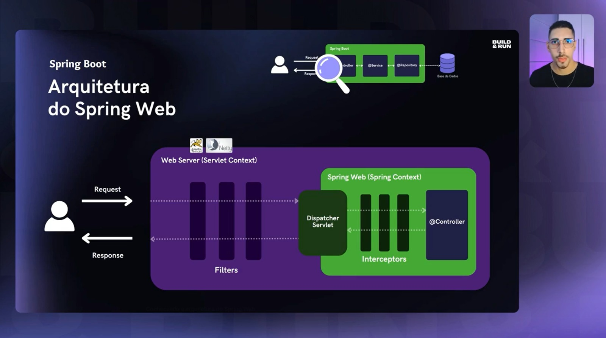
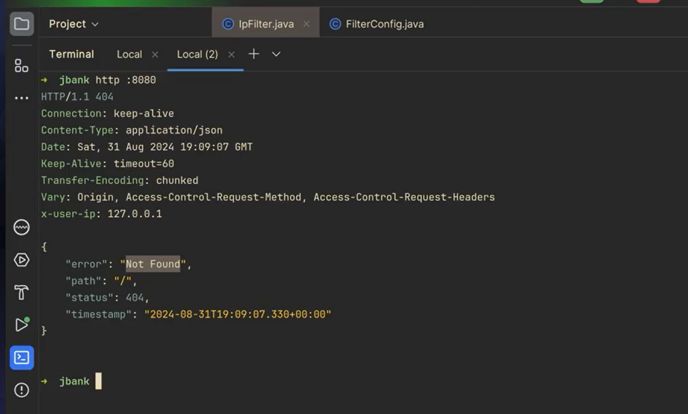

Ter instalado o docker.

Após abrir o docker, acessar a pasta do Docker, através do comando cd docker, e depois digitar
docker-compose up

Contexto sobre filter e interceptors

Exemplos da chamada e do log do Filter, após a chamada no endpoint http://localhost:8080

